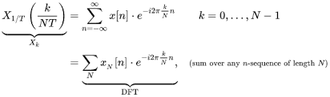
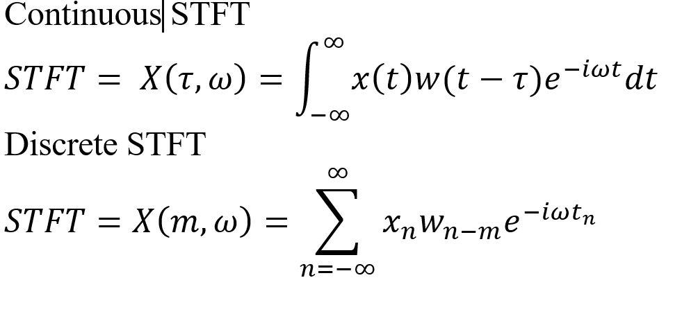
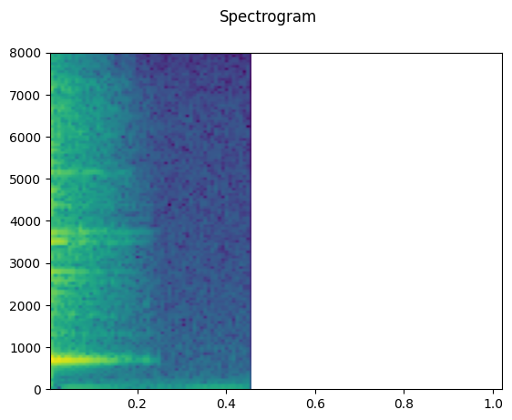

# Music-Generation using MelGAN

Music-Generation using MelGAN is a generative model that is designed to create realistic music samples using a set of input features. MelGAN stands for "Mel-spectrogram Generative Adversarial Network" and it is a variant of the popular Generative Adversarial Networks (GANs) used in image generation.

## MelGan

MelGAN (Mel-spectrogram Generative Adversarial Network) is a type of generative adversarial network (GAN) that is specifically designed for speech synthesis. It was introduced in a research paper titled "MelGAN: Generative Adversarial Networks for Conditional Waveform Synthesis" by Kundan Kumar, Rithesh Kumar, Thibault de Boissiere, Lucas Gestin, Wei Zhen Teoh, Jose Sotelo, Alexandre de Brebisson, Yoshua Bengio, Aaron Courville, and Aaron van den Oord, which was published in the Proceedings of the 36th International Conference on Machine Learning (ICML) in 2019.

MelGAN is capable of generating high-quality speech from mel-spectrograms, which are representations of speech signals that capture the spectral content over time. MelGAN is trained using a conditional GAN framework, where the generator is trained to produce realistic speech samples from mel-spectrograms, and the discriminator is trained to distinguish between real speech and generated speech.

One of the advantages of MelGAN over other speech synthesis models is that it can generate speech with a high level of fidelity and naturalness, even at lower sampling rates. This makes it useful for applications where low-latency and low-bandwidth speech synthesis is required, such as in voice assistants, chatbots, and other natural language processing systems.

### Math behind MelGAN

### Discrete Fourier Transform

Discrete Fourier Transform (DFT) is a mathematical technique used to analyze the frequency components of a discrete-time signal. It takes a finite sequence of equally spaced samples of a function and decomposes it into a sum of complex sinusoids. The DFT is defined as:

### Short-Time Fourier Transform (STFT)

Short-Time Fourier Transform (STFT) is a signal processing technique used to analyze the frequency content of a signal over time. It involves dividing the signal into short overlapping time segments, and then applying the Fourier transform to each segment to obtain its frequency content. The resulting frequency content for each segment is then plotted as a function of time to produce a spectrogram.

The STFT provides a way to analyze non-stationary signals, where the frequency content of the signal changes over time. It is widely used in applications such as speech processing, music analysis, and biomedical signal analysis.

One advantage of STFT over the standard Fourier transform is that it provides time-varying frequency information, which is useful for analyzing signals with time-varying frequency content. However, a disadvantage of STFT is that the time and frequency resolution are trade-offs. Increasing the time resolution (i.e., reducing the length of the time segments) reduces the frequency resolution, and vice versa.

In short-time Fourier transform (STFT), the input signal is first divided into short overlapping segments or windows, and then Fourier transform is applied to each window to obtain its frequency spectrum. The length of the window and the degree of overlap between consecutive windows are important parameters that affect the quality of the STFT output.

The window function is a mathematical function that is multiplied with each segment of the signal before applying Fourier transform. The purpose of the window function is to reduce the spectral leakage and smearing that occurs due to the sudden truncation of the signal at the edges of the window. Window functions have a wide range of shapes, such as rectangular, Hamming, Hanning, and Blackman, and the choice of the window function depends on the specific application and the desired trade-off between spectral resolution and sidelobe suppression.

The hop size, or the step size, is the amount of overlap between adjacent windows. Overlapping windows allow for a smoother transition between adjacent segments and result in a more continuous representation of the signal over time. The hop size can be smaller than the window size to achieve higher temporal resolution or larger than the window size to reduce the computational complexity of the STFT. The choice of the hop size also affects the frequency resolution of the STFT output, as well as the ability to track rapid changes in the signal over time.

### Mel-Spectrogram

Mel spectrogram (or Mel-frequency spectrogram) is a type of spectrogram that is commonly used in speech and music analysis. It is a way to represent the power spectral density of a signal in the frequency domain, where the frequency scale is divided into a set of mel-spaced frequency bins.

The mel scale is a perceptual scale of pitches judged by listeners to be equal in distance from one another. Mel-scale frequency spacing is more appropriate for human auditory perception than linear frequency spacing. The mel scale is based on the concept of critical bands, which are the frequency ranges in which the human ear can detect a sound.

In a Mel spectrogram, the magnitude of each frequency bin is weighted according to a set of triangular overlapping windows that are spaced based on the mel scale. The triangular windows are designed to approximate the shape of the critical bands in the human auditory system. The magnitude of each windowed frequency bin is then squared and summed over time to obtain a spectrogram that represents the power spectral density of the signal in the mel-frequency domain.

Mel spectrograms are commonly used in speech and music analysis because they provide a more compact and perceptually relevant representation of the frequency content of a signal than traditional spectrograms. They are also used in machine learning applications, such as speech recognition and music genre classification, because they can be used as input features to machine learning models.

## MelGAN Architecture

The model works by taking as input a sequence of Mel-spectrograms, which are a visual representation of the frequency content of an audio signal, typically used in speech and music processing. The MelGAN model is trained to generate realistic audio samples that match the input Mel-spectrogram sequence.

The MelGAN model consists of two main components: the generator and the discriminator. The generator is responsible for producing the generated audio samples, while the discriminator is responsible for distinguishing between real and fake audio samples.

### Generator

The generator takes as input a sequence of Mel-spectrograms, which are fed through a series of transposed convolutional layers to upsample the input features to the desired audio sample rate. The output of the generator is a sequence of audio samples, which are optimized to match the input Mel-spectrograms.

The Generator class is a neural network model that takes as input a tensor of shape `(batch_size, 20, 1, 1)`, where batch_size is the number of samples to generate, and outputs a tensor of shape `(batch_size, 1, 64, 16)`, where each sample is a 2D array of shape `(64, 16)`. The purpose of the Generator is to generate realistic speech samples from a random input tensor.

The Generator has five layers of transpose convolutional neural networks (also called "deconvolution" layers) that upsample the input tensor. Each layer has a different number of output channels and kernel size, which progressively increases the spatial dimensions of the output tensor until it reaches the desired shape of `(batch_size, 1, 64, 16)`. The first layer takes as input a tensor of shape `(batch_size, 20, 1, 1)`, which corresponds to a 20-dimensional vector of randomly generated noise, and outputs a tensor of shape `(batch_size, 256, 3, 2)`. The other layers follow a similar pattern of upsampling and increasing the number of channels, until the final layer outputs a tensor of shape `(batch_size, 1, 64, 16)`. The activation function used in all layers is the scaled exponential linear unit (SELU), which is known to perform well in deep neural networks.

### Discriminator

The discriminator takes as input both real and generated audio samples, and it is trained to distinguish between the two. The discriminator consists of a series of convolutional layers that process the audio samples to extract useful features, which are then used to make a binary classification decision on whether the input is real or fake.

The Discriminator class is a neural network model that takes as input a tensor of shape `(batch_size, 1, 64, 16)`, where each sample is a 2D array of shape `(64, 16)`, and outputs a tensor of shape `(batch_size, 1)`, where each value is a probability score between 0 and 1 that indicates whether the input sample is real or fake. The purpose of the Discriminator is to discriminate between real speech samples and generated speech samples.

The Discriminator has five layers of convolutional neural networks that downsample the input tensor. Each layer has a different number of output channels and kernel size, which progressively reduces the spatial dimensions of the output tensor until it reaches a tensor of shape `(batch_size, 128, 2, 2)`. The output of the last convolutional layer is flattened into a 1D tensor, which is then fed into two fully connected layers. The first fully connected layer reduces the number of features to 64, and the second fully connected layer outputs a single value between 0 and 1 using the sigmoid activation function, which is interpreted as the probability score for the input sample being real or fake. The activation function used in all convolutional layers is the SELU, and the final output uses the sigmoid activation function.

## Training

During training, the generator and discriminator are trained together in a two-player minimax game. The generator aims to produce audio samples that are indistinguishable from real samples, while the discriminator aims to correctly classify real samples and reject fake samples. The generator is updated to minimize the loss function, which measures the difference between the generated and real audio samples, while the discriminator is updated to maximize the loss function, which measures the difference between the predicted and true labels.

We are implementing the MelGAN architecture for music generation. We start by defining the necessary variables and imports, including the audio directory, sample rate, and number of samples, and creating a MelSpectrogram object for transforming the audio data into Mel-spectrograms. The Mel-spectrograms are then loaded into an AudioDataset object and fed into a data loader to feed the data to the model during training.

We then defines the generator and discriminator models, which are the main components of the MelGAN architecture. The generator takes a noise vector as input and generates a Mel-spectrogram, while the discriminator takes a Mel-spectrogram and classifies it as either real or fake. The models are initialized with random weights.

We then sets up the loss function and optimizer for training the models. It uses `binary cross-entropy loss` and `Adam` optimizer with a learning rate of `0.0002` and `beta1` of `0.5`. The number of `epochs` is set to `5000`.

The main training loop starts with a nested loop over the data loader. For each batch of real Mel-spectrograms, the discriminator is trained to correctly classify them as real. Then, the generator is trained to generate Mel-spectrograms that can fool the discriminator into classifying them as real. The losses and other statistics are recorded during the training process and printed out every `50 epochs`.

Overall, have done the basic implementation of the MelGAN architecture for music generation and can be adapted for different datasets and use cases.

## Results

Once the MelGAN model is trained, it can be used to generate new music samples by feeding in a sequence of Mel-spectrograms, which are then processed by the generator to produce realistic audio samples. These generated samples can be used for a variety of applications, such as music production, sound design, and audio synthesis.

Results of the MelGAN model after training for 500 epochs:

- The discriminator loss (Loss_D) decreases from `0.7335` to `0.0450`.
- The generator loss (Loss_G) initially increases from `1.2703` to `4.2079` and then decreases to `3.9134`.
- The discriminator's ability to distinguish between real and fake images (D(x) and D(G(z))) improves over time, with D(G(z)) approaching 0 and D(x) approaching 1.

From the results, we can see that the Discriminator loss decreases over time, which means that the Discriminator becomes better at distinguishing real data from fake data. Meanwhile, the Generator loss initially increases, which is expected since it takes time for the Generator to learn to produce convincing fake data. However, it later stabilizes as the Generator gets better at producing data that can fool the Discriminator. We can also see that the Discriminator output for real data (D(x)) is close to 1, indicating that the Discriminator can easily recognize real data, while the Discriminator output for generated data (D(G(z))) increases over time as the Generator improves.

## Conclusion

Overall, it appears that the generator is learning to create more realistic images over time, as evidenced by the decreasing discriminator loss and increasing accuracy in distinguishing between real and fake images. However, there may be some fluctuations in the generator loss during training, which could suggest that the generator is struggling to improve at certain points.
